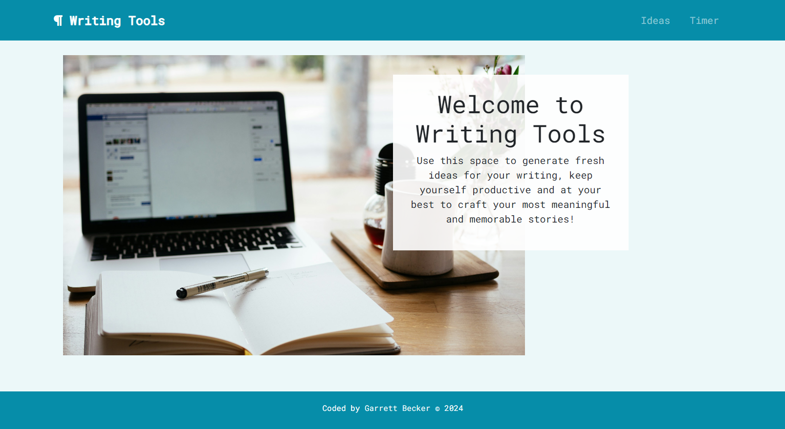
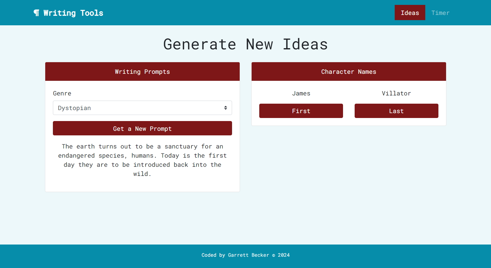
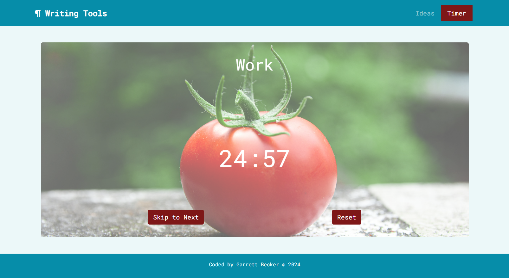

# Writing Tools Angular App

After finishing Brad Traversy's [Angular Front to Back course on Udemy](https://www.udemy.com/course/angular-4-front-to-back/) and working on my ASL Zone app to learn sign language, I had this idea to create a central place to support writers at all stages to write their best stories. What tools could they (and selfishly myself because I'd love to be writing creatively more!) need to help them cure writer's block? Or in general make the best use of their time as they go after it? My initial thoughts were to at least include a pomodoro timer and a bank of ideas to randomly generate to get new ideas going. I've built a lot with React.js and Next.js so I thought this could be another great way to practice building with Angular and I'm happy with how this turned out!

Writing Tools is a place all writers at any point in their journeys can go to get some new ideas or time themselves for work/breaks to effectively use the constraints they have and keep themselves motivated. The Ideas page includes generators for writing prompts across different genres at the click of a dropdown, as well as for first and last character names. All data is housed in a custom Firebase database. There is also a pomodoro timer on the next page writers can set up with their work and break time preferences, and check marks at the bottom of the screen keep track of how many work/break cycles they completed.

## Table of contents

- [Writing Tools Angular App](#writing-tools-angular-app)
	- [Table of contents](#table-of-contents)
	- [Overview](#overview)
		- [Home Page](#home-page)
		- [Ideas Page](#ideas-page)
		- [Timer Page](#timer-page)
		- [Links](#links)
	- [My process](#my-process)
		- [Built with](#built-with)
		- [What I learned](#what-i-learned)
		- [Continued development](#continued-development)
		- [Useful resources](#useful-resources)
	- [Author](#author)

## Overview

### Home Page



### Ideas Page



### Timer Page



### Links

- [Live Site URL](https://writingtools-6b653.web.app)

## My process

### Built with

- [Angular](https://angular.io/) - frontend framework
- Typescript
- HTML5
- CSS
- Bootstrap
- Firebase
- Mobile-first workflow
- [VS Code](https://code.visualstudio.com)

### What I learned

Since the idea behind this project is to support writers with various tools for any point in their journey, I knew I wanted to keep everything as clutter-free as possible, as well as plan for scalability. The Ideas page for now has generators for writing prompts and character names, but it's simple to grow and extend the page to include more, such as location names. I had a great time figuring out how to make the pomodoro timer to work like I wanted - I first made sure the timer functionality worked with set work/break times, and then I adjusted the page to include a form to set up custom values. The form will disappear upon successful submission to reveal the timer, ready to use. Creating the service modules for genre, prompt, and name data gave more practice for using Angular observables which was great.

I thought about including Firebase authentication but ultimately decided against it because I wanted this site to be an easy place anyone can come to get help with their writing. And there wasn't data that directly tied to a specific user so I didn't see the need quite yet to add users. In the future I might add some more functionality which may include the need to add users.

Here are a few code samples from this project:

```ts
// Picking a random prompt on the Ideas page
onPromptSubmit({ value, valid }: { value: any; valid: boolean }) {
	if (!valid) {
		// show error
		alert('Please fill out all fields correctly');
	} else {
		this.promptsService.getPromptsByGenre(value.genre).subscribe(prompts => {
			prompts.forEach(prompt => {
				this.genresService.getGenre(prompt.genre.id).subscribe(genre => {
					prompt.genre = genre;
				});
			});
			// randomly shuffle
			prompts = this.shuffle(prompts);

			// assign first prompt
			this.prompt = prompts[this.index];

			// assign shuffled prompts to list
			this.prompts = prompts;
		});
	}
}
```

```ts
// Part of the Pomodoro timer functionality
startTimer() {
	this.reps += 1;
	clearTimeout(this.timer);

	this.leftBtnLabel = "Skip to Next";

	const workSec = this.workMin * 60;
	const shortBreakSec = this.shortBreakMin * 60;
	const longBreakSec = this.longBreakMin * 60;

	// if it's the 1st/3rd/5th/7th rep:
	if (this.reps % 8 === 0) {
		this.timerLabel = "Long Break";
		this.countDown(longBreakSec);
	} else if (this.reps % 2 === 0) {
		this.timerLabel = "Short Break";
		this.countDown(shortBreakSec);
	} else {
		this.timerLabel = "Work";
		this.countDown(workSec);
		const numMarks = Math.floor(this.reps / 2);
		const marksArray = [];

		for (let i = 0; i < numMarks; i++) {
			marksArray.push("✔");
		}

		this.checkMarks = marksArray.join("");
	}
}
```

```html
<!-- Pomodoro Timer structure -->
<div *ngIf="ready" class="container">
  <div class="bg">
    <div class="overlay">
      <div class="content">
        <h1>{{ timerLabel }}</h1>
        <h2>{{ timerText }}</h2>

        <div class="row">
          <button class="btn btn-submit" (click)="startTimer()">{{ leftBtnLabel }}</button>
          <div *ngIf="checkMarks" class="btn checkMarks">{{ checkMarks }}</div>
          <button class="btn btn-submit" (click)="resetTimer()">Reset</button>
      </div>
    </div>
    
    
  </div>
</div>
```

### Continued development

As a starter developer, I want to keep discovering different tools and finding different ways of building, because one stack might be better for a situation than another. For a while I was getting used to React.js and Next.js, so I wanted to try building an entire Angular app on my own to make myself uncomfortable and be able to learn through challenges that arise. Working on this project gives me confidence to keep doing this!

### Useful resources

- [Stack Overflow](https://stackoverflow.com/) - Stack Overflow was a lifesaver for this project especially when figuring out intricacies with those Angular Observables and grabbing data from Firebase. Finding different answers that contributed to different parts of the challenges I had helped me piece together what I needed.

## Author

- Website - [Garrett Becker]()
- LinkedIn - [Garrett Becker](https://www.linkedin.com/in/garrett-becker-923b4a106/)